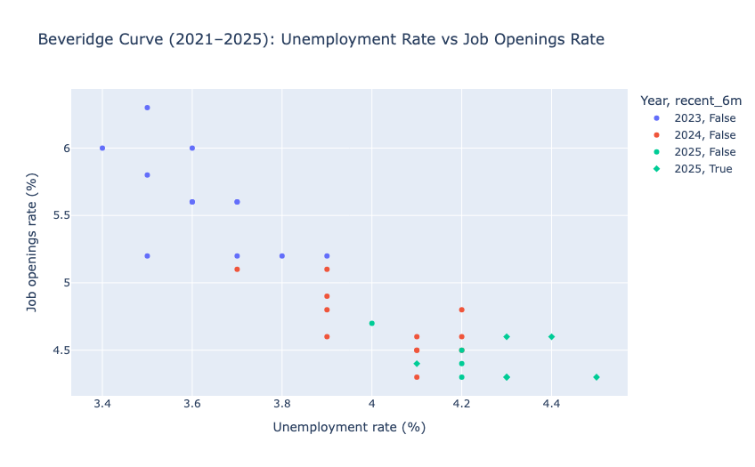
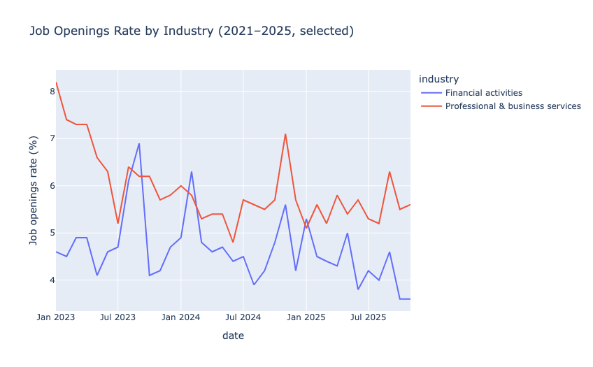
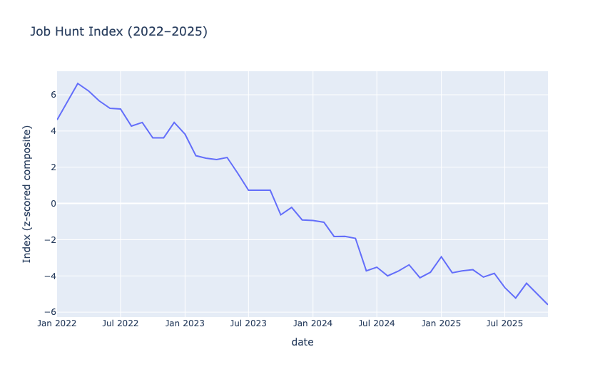
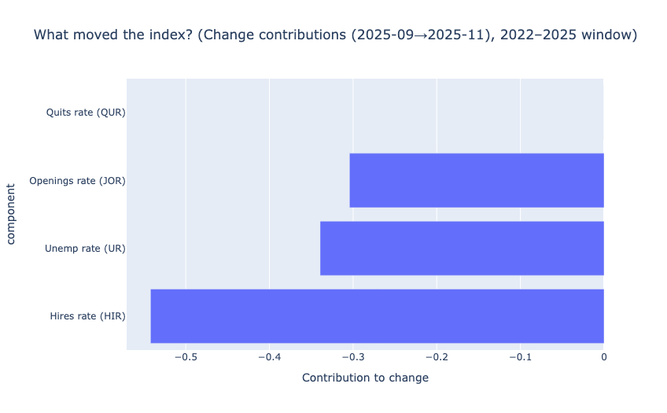
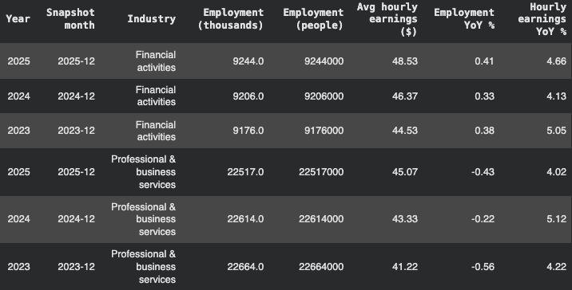
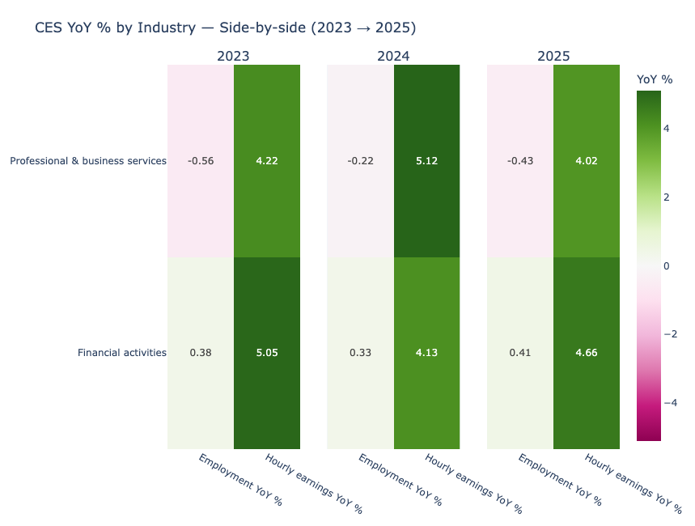

# U.S. Job Market Data Exploration (BLS JOLTS + CES)

A lightweight portfolio project exploring U.S. labor-market conditions using **BLS JOLTS** (openings/hires/quits), the **unemployment rate (U‑3)**, and **BLS CES** (sector employment & hourly earnings).

The repo is intentionally simple: one notebook + a handful of figures + this README to interpret what’s going on.

**Notebook:** [`notebooks/Job_Market_Data_Exploration.ipynb`](notebooks/Job_Market_Data_Exploration.ipynb)

---

## TL;DR (what the charts say)

- **Cooling since 2023:** the Beveridge curve shifts toward **lower openings and higher unemployment** versus 2023.
- **Job seekers’ environment deteriorated:** the Job Hunt Index trends from strongly positive in 2022 to **deeply negative by late‑2025**.
- **The latest drop is mostly “hiring momentum” slowing:** recent changes are dominated by **hires** (and secondarily openings / unemployment).
- **Business & finance sectors:** **wage growth stays ~4–5% YoY** even as **employment growth is flat to slightly negative**.

---

## Questions I’m trying to answer

1. **How “tight” is the labor market?** (vacancies vs. unemployment)
2. **How might the market *feel* to a job seeker?** (a composite “Job Hunt Index”)
3. **Where are jobs and wage growth concentrated?** (selected CES industries)

---

## Why this matters

Labor market headlines can be noisy. This project focuses on a few **high-signal indicators** (JOLTS openings/hires/quits, unemployment, and CES employment/earnings) to translate “the job market” into something you can actually *reason about*.

### Real-world impact

- **For job seekers:** Openings vs. unemployment (the Beveridge curve) helps answer “Is it getting harder to find a job?” and the **Job Hunt Index** summarizes whether conditions are tightening or loosening over time.
- **For employers & recruiting teams:** Openings/hires/quits capture whether the market is **cooling** (fewer openings, lower churn) or **heating up** (more openings, more voluntary quits), which affects hiring plans, retention strategy, and compensation pressure.
- **For investors & business leaders:** Wage growth and employment momentum by sector (CES YoY) provide a quick read on where demand is strengthening vs. weakening — useful for **forecasting consumer strength, margins, and recession risk**.
- **For policy & macro analysis:** These series are commonly used to assess **labor market tightness**, matching efficiency, and inflation pressures, making them a practical toolkit for macro monitoring.

### What this repo adds

Instead of one chart, it connects multiple views — **macro tightness (Beveridge curve)**, a **single composite indicator (Job Hunt Index)**, and **sector-level employment vs. wage growth (CES YoY)** — so you can tell a coherent story about where the labor market is headed.


---

## Repo contents

- Notebook: `notebooks/Job_Market_Data_Exploration.ipynb`
- Figures used in this README: `figures/*.png`
- Data notes + expected file names: `data/README.md`

## Data & tools

**Data sources (BLS flat files)**
- **JOLTS**: job openings, hires, quits
- **CPS / Labor Force**: unemployment rate (U‑3)
- **CES**: employment + average hourly earnings by industry

**Stack**: Python, pandas, Plotly (optional: Kaleido to export PNGs).

> Note: The full CPS unemployment flat file is huge. In practice, it’s best to filter it down to the single U‑3 series (`LNS14000000`) and commit a small CSV (or keep the raw file gitignored).

---

## Visual 1 — Beveridge Curve (Unemployment vs Job Openings)



**What this shows**
- Each point is a month.
- X-axis: **unemployment rate (%)**
- Y-axis: **job openings rate (%)**

**How to read it**
- A “hot” labor market typically sits in the **upper-left** (high openings + low unemployment).
- Moving **down/right** generally indicates cooling conditions (openings fall, unemployment rises).

**What I see in 2021–2025**
- 2023 clusters at **higher openings (~5–6%+)** with **lower unemployment (~3.4–3.9%)**.
- By 2024–2025, points shift to **lower openings (~4.3–4.8%)** with **higher unemployment (~4.0–4.5%)**.
- The last 6 months in 2025 are highlighted, showing the market sitting in a noticeably cooler region than 2023.

### Why it might look like this
- **Post-pandemic normalization:** 2022–2023 was the tail-end of an unusually tight market where demand for labor stayed high even as supply constraints persisted. Over time, that “tightness premium” fades.
- **Cooling demand / fewer postings:** As firms get more cautious, the first thing to drop is often **open requisitions** (openings) before unemployment moves a lot.
- **Matching becomes less frantic:** When openings fall and unemployment rises, it usually signals job seekers have less leverage and firms face less urgency to fill roles.

### Implications
- The market appears to be shifting from “employee-driven” toward “employer-driven.”
- For job seekers: expect **longer search times**, more competition per role, and more emphasis on differentiation (targeting, networking, skill signaling).
- For employers: easier recruiting vs. 2022–2023, but the market can still remain “tight” in specific skill pockets even if aggregate conditions cool.


### Sector demand check — Job openings rate by industry



This line chart zooms into job-openings rates for two white-collar sectors:
- **Professional & business services (PBS)** tends to run **higher** than **financial activities** in this window.
- Both series look **lower/softer by late‑2025** than their peaks earlier in the period (especially financial activities).

### Why it might look like this
- **Professional & business services** is often a “cycle amplifier” — it includes roles like consulting, services, and business support that expand quickly when demand is strong and pull back when uncertainty rises.
- **Financial activities** tends to be steadier, but can cool if credit conditions tighten, deal volume slows, or firms prioritize efficiency.

### Implications
- “The job market” isn’t one market — **industry matters**. A cooling macro environment can still leave specific sectors relatively resilient.
- For job seekers: timing and targeting matter. If one sector is softening, consider adjacent sectors where hiring demand is steadier.

---

## Visual 2 — “Job Hunt Index” (a simple composite)



I built a simple index to summarize how the job market might *feel* to job seekers:

```text
Job Hunt Index = z(Openings Rate) + z(Hires Rate) + z(Quits Rate) - z(Unemployment Rate)
```

- `z(x)` is the z-score within the analysis window.
- Higher values ≈ easier conditions (more openings/hires/quits, lower unemployment).

**Interpretation**
- The index trends steadily downward from 2022 → 2025, which is consistent with a market that’s moved from “very tight” to much more normal (and, by late‑2025, job-seeker‑unfriendly).

### Why it might look like this
- **The “great reshuffle” fades:** In 2022, high quits and strong hiring reflected worker confidence and rapid churn. That tends to normalize as opportunities become less abundant.
- **Hiring slows before layoffs spike:** Many slowdowns are characterized by fewer hires and openings first — unemployment can rise more gradually.

### Implications
- The direction suggests **reduced worker bargaining power** vs. 2022.
- A declining index typically aligns with: more selective hiring, slower offer cycles, fewer “easy” lateral moves, and higher importance of role fit.


### What moved the index most recently?



This chart decomposes the latest index change (Sep → Nov 2025 in my run) into **component contributions**.

- The largest negative contribution comes from **hires**, suggesting job-finding momentum weakened.
- **Openings** and **unemployment** also contribute negatively.
- **Quits** shows no visible bar here because it didn’t meaningfully change over that particular step (so its contribution is ~0).

### Why it might look like this
- **Hiring is the “real-time throttle”:** Firms often reduce hiring activity quickly when they become uncertain, even if they’re not laying off aggressively.
- **Openings fall alongside hiring:** Fewer posted roles and fewer hires tend to reinforce each other — postings drop, pipelines shrink, and hiring managers become pickier.

### Implications
- If hires are the main drag, the story is less “mass layoffs” and more **slower throughput into jobs**.
- For job seekers, this often means: fewer entry points, more multi-round processes, and more reliance on referrals/credible signals.


---

## Visual 3 — CES snapshots (employment vs wage growth)

The goal here is to connect “macro” cooling to what’s happening in **pay** and **headcount** for two sectors:
- **Financial activities**
- **Professional & business services**

### Snapshot table (year-end)



A quick read of the latest snapshot (Dec 2025 in the figure):
- **Financial activities:** employment **+0.41% YoY**, hourly earnings **+4.66% YoY**
- **Professional & business services:** employment **-0.43% YoY**, hourly earnings **+4.02% YoY**

### Side-by-side YoY heatmap (2023 → 2025)



**What stands out**
- Employment growth is **flat to slightly negative** (especially in PBS), but
- Wage growth remains **solid (~4–5% YoY)** across years.

### Why it might look like this
- **“Soft landing” dynamics:** Firms can slow headcount growth (or even shrink slightly) while still raising wages — especially if inflation, retention needs, or competition for high-skill roles persists.
- **Composition effects:** If lower-wage roles are cut or hiring shifts toward more senior roles, the *average* wage can rise even if the labor market is cooling.
- **Sticky wage behavior:** Wages don’t always fall quickly when demand cools; instead, firms may slow hiring and bonuses before cutting base pay growth.

### Implications
- One way to read this: firms may be **holding the line on compensation** while being more cautious about **net headcount expansion**.
- You can see a narrative of **cautious hiring + continued pay pressure** (especially in specialized work).
- For employers: wage growth staying elevated while headcount stalls can squeeze margins → more focus on productivity, automation, and selective hiring.
- For job seekers: fewer new seats, but strong pay in certain roles may persist — the market becomes more about **getting the right role** than just getting *any* offer.


---

## How to run

1. Create and activate a virtual environment
2. Install dependencies:

```bash
pip install -r requirements.txt
```

3. Place BLS flat files in `data/raw/` (or commit smaller processed versions in `data/processed/`).
4. Open and run the notebook in `notebooks/`.

---

## Repo layout

```
.
├── notebooks/
├── figures/
├── data/
│   ├── raw/          # gitignored (large BLS files)
│   └── processed/    # small derived files you can commit
├── requirements.txt
└── README.md
```

---

## Possible extensions

- Add more industries (e.g., Information, Healthcare, Government).
- Swap plain z-scores for **rolling** z-scores to emphasize regime shifts.
- Package the visuals into a simple dashboard (Streamlit) or a Quarto report.
